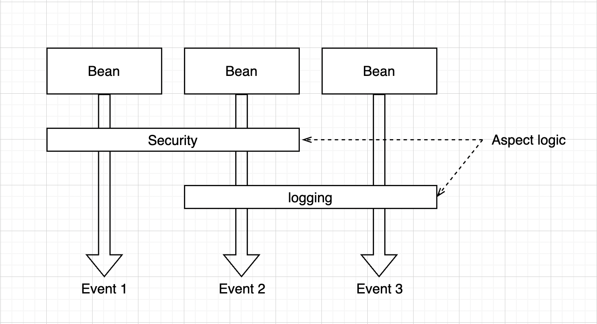
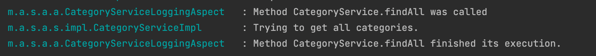

## Аспектно ориентированное программирование (АОП)

Было время, когда разработка программ велась исключительно в процедурном стиле, что конечно же имело свои преимущества, 
например, скорость написания кода и возможность обратиться к любой процедуре из любой точки программы неограниченное количество раз.

> Процедурное программирование - это парадигма программирования основанная на концепции разделения кода на подпрограммы или процедуры, 
содержащие ряд вычислительных шагов, которые необходимо выполнить.

Но такой подход оказалось абсолютно неэффективным с ростом проектов и необходимостью их долгосрочной поддержки и расширения.
Тогда на помощь пришло ООП с его модульностью и понятными человеку абстракциями,
что не только решило вышеперечисленные недостатки ПП, но стало толчком в развитии отрасли в целом. 
Чем проще работать с кодом, чем меньше у программистов уходит времени на обучение и разработку, тем больше денег зарабатывает бизнес. 
Именно поэтому главным критерием качества вашего кода считается его читабельность и ясность.
Какое-то время спустя, для выполнения всё тех же задач, Робертом Мартином были сформулированы 5 принципов проектирования 
ясной и расширяемой архитектуры приложений, первые буквы которых, так ловко сложились в английское слово **solid**.
Согласно первому его принципу, каждый юнит **(method, class, package, module)** вашего кода должен отвечать за выполнение 
только одной задачи на одном уровне абстракции.
Казалось бы, всё ясно, но как быть с тем кодом, который необходимо выполнять параллельно основному. Например, 
как посчитать время работы метода не нарушив при этом SRP ни в самом методе, ни в классе, в котором он вызывается? 
На этот вопрос нам и ответит **АОП**.

> **АОП** - парадигма программирования основная на идее разделения основного и служебного функционала.
К служебному функционалу относится код не касающийся непосредственно бизнес задачи.

##### Пример бизнес задачи:
- Чтение данных из файла;

##### Примеры служебной задачи:
- Проверка доступа пользователя к файлу;
- Логирование служебной информации;
- Обработка исключений;

Для решения задачи в аспектно ориентировании стиле, нам необходимо вынести сквозную логику за пределы метода. 
В этом уроке мы рассмотрим несколько примеров того, как это можно сделать с использованием **Spring Framework** и расширением **AspectJ**.

## Логирование с применением АОП.

Чтобы начать использовать магию аспектно ориентированного программирования в связке со спринг бутом, первое, что нам необходимо сделать это добавить 2 зависимости в `pom.xml` файл.  
**spring-aspects** - для подключения модуля спринга, а так же библиотеку **aspectj**, так как спринг под капотом использует его методы.

        <dependency>
            <groupId>org.springframework</groupId>
            <artifactId>spring-aspects</artifactId>
            <version>RELEASE</version>
        </dependency>
        <dependency>
            <groupId>org.aspectj</groupId>
            <artifactId>aspectjrt</artifactId>
            <version>1.9.9.1</version>
        </dependency>

После подключения зависимостей нам становятся доступны все необходимые аннотации и можно переходить к написанию первого **аспект класса**.

> Aspect class - класс содержащий сквозную логику, объединённую по её контексту и области взаимодействия с проектом. 

Создадим новый пакет и класс с соответствующим его контексту именем. Для того чтобы класс стал аспектным поставим аннотацию `@Aspect` и `@Component`.

И следующее понятие с которым нам необходимо познакомиться это **Advice**.

> **Advice** - метод находящийся внутри аспект класса, который содержит сквозную логику, 
такую как: логирование, профилирование, контроль доступа, обработка транзакций, обработка исключений, кеширование и т. д.

Advices делятся на несколько видов, каждый из которых будет отрабатывать на определённой фазе выполнения метода:
- **Before** (`@Before`)
- **After** / **After finally** (`@After`)
- **Around** (`@Around`)
- **After returning** (`@AfterReturning`)
- **After throwing** (`@AfterThrowing`)

Для примера, создадим метод, который логирует информацию об этапах работы метода `findAll` интерфейса `CategoryService`.

    @Log4j2 
    @Aspect
    @Component
    public class CategoryServiceLoggingAspect {
        @Before("execution(* mate.academy.springboot.aop.service.CategoryService.findAll())")
        public void beforeCategoryServiceFindAllMethodAdvice() {
            log.info("Method CategoryService.findAll was called");
        }
        
        @After("execution(* mate.academy.springboot.aop.service.CategoryService.findAll())")
        public void afterCategoryServiceFindAllMethodAdvice() {
            log.info("Method CategoryService.findAll finished its execution.");
        }
    }

Как мы видим, для того, чтобы сконфигурировать наши advice методы, мы использовали аннотации `@Before` и `@After` в которые
передали паттерн описывающий сигнатуру метода. Такие выражения называют *pointcuts*.
(Для указания конкретного юнита нам нужно прописать полный путь его местонахождения.)

Для написания **pointcut** в спринге используется **AspectJ Pointcut expression language**.
Они имеют следующую структуру:
    
    execution(modifiers-pattern? ret-type-pattern declaring-type-pattern?name-pattern(param-pattern) throws-pattern?)

- **modifiers-pattern** - (опциональный) Видимость метода (public, protected, private, *) 
- **ret-type-pattern** - Возвращаемы тип метода
- **declaring-type-pattern** - (опциональный) Пакет или класс (например: com.app.service.* — применяется ко всем классам в этом пакете, com.app.service.UserService — применяется только к классу UserService, * — все)
- **name-pattern** - имя метода (пример: set* - все сеттеры)
- **param-pattern** - параметры метода (.. - любое количество параметров, java.lang.String - метод, принимающий String в качестве параметра.)
- **throws-pattern** - (опциональный) метод, выбрасывающий это исключение.

Если присмотреться к предыдущему примеру, мы увидим, что в обоих советах мы прописали абсолютно одинаковые pointcut выражения.
Как известно, дублирования кода всегда нужно избегать и было бы круто если бы и у нас была возможность вынести pointcut отдельно и ссылаться на него сколько угодно раз. Благо такая возможность есть. Сделать это можно с помощью аннотации
`@Pointcut`, которая ставится над методом и принимает **pointcut expression** в качестве аргумента.
Тело таких методов исполняться не будет. Единственное на что стоит обращать внимание, при их создании - модификатор доступа.  
Далее нам необходимо передать имя метода в аннотацию совета, которые так же можно комбинировать с помощью операторов && || и !.
Давайте улучшим наш код воспользовавшись новой информацией.

    @Pointcut("execution(* mate.academy.springboot.aop.service.CategoryService.findAll())")
    prviate void findAllCategoryServiceMethod() {}

    @Before("findAllCategoryServiceMethod()")
    public void beforeCategoryServiceFindAllMethodAdvice() {
        log.info("Method CategoryService.findAll was called");
    }

    @After("findAllCategoryServiceMethod()")
    public void afterCategoryServiceFindAllMethodAdvice() {
        log.info("Method CategoryService.findAll finished its execution.");
    }

Для наглядности, добавим вывод сообщения в метод `findAll` и запустим проект. 
После отправки GET запроса на endpoint `/categories` увидим следующую картину в консоли: 

> **Join points** - это моменты выполнения программы в которые
необходимо внедрить дополнительный код. Например: вызов метода или обращение к полю класса.

Чтобы получить доступ к сигнатуре метода, аргументам и другой информации о `join points`,
можно воспользоваться объектом `JoinPoint`, который будет передан в параметры **advice**.

    @Before("execution(public * mate.academy.springboot.aop.service..*(..))")
    public void beforeServiceMethodAdvice(JoinPoint joinPoint) {
        log.info(String.format(
                "Method %s.%s was called. Arguments: %s",
                joinPoint.getSignature().getDeclaringTypeName(),
                joinPoint.getSignature().getName(),
                Arrays.toString(joinPoint.getArgs())
        ));
    }

В этом примере для нашего **advice** били установлены следующие конфигурации:
- Он должен быть отработан перед каждым методом, который находится в пакете service;
- Модификатор доступа - `public`;
- Метод может возвращать любой тип данных и принимать любой набор аргументов.
Благодаря такому подходу, у нас больше нет необходимости дублировать один и тот же код в каждом методе,
теперь его внедрение будет происходить автоматически везде, где нужно.
Так же, благодаря объекту `JoinPoint`, мы прокачали наше логирование и теперь, 
кроме сообщения, мы так же выводим информацию передаваемых аргументах.

## Профилирование с применением AOP

Рассмотрим ещё один пример, в котором мы измерим скорость выполнения каждого метода класса `TimeWasteService` с использованием объекта
`ProceedingJoinPoint` а так же стандартным классом спринга `StopWatch`.

    @Log4j2
    @Aspect
    @Component
    public class ProfilingAspect {
        @Pointcut("within(mate.academy.springboot.aop.service.TimeWasteService)")
        public void allMethodsFromTimeWasteService() {
        }

        @Around("allMethodsFromTimeWasteService()")
        public Object profileTimeWasteService(ProceedingJoinPoint proceedingJoinPoint) throws Throwable {
            StopWatch stopWatch = new StopWatch();
            stopWatch.start();
            Object result = proceedingJoinPoint.proceed();
            stopWatch.stop();
            log.info(stopWatch.prettyPrint());
            return result;
        }
    }

Тут нам пригодился указатель `within`, который определяет в пределах какого типа будет отрабатывать данный **advice**.

Помимо основного `execution` и `within`, AspectJ поддерживает и другие указатели для более частных случаев, такие как:
- `this` и `target` - выполнение точки соединения, соответствующей объекту указанного типа;
- `args` - выполнение точки соединения, в которой доступен аргумент указанного типа;
- `call` - вызов метода или набора методов подходящих по условию;
- `initialization` - инициализация класса;

Итого мы узнали, как написать простейший аспект класс и познакомились с основными понятиями данного подхода, такими как:
**Aspect**, **Join point**, **Advice**, **Pointcut**.

### Преимущества
Благодаря отделению основной логики метода, цель которой описана в его имени,
от второстепенных служебных задач мы одновременно добиваемся
- Соблюдение принципа единой ответственности
- Соблюдение принципа Don't repeat yourself.
- Лёгкость чтения и понимания основной логики проекта.
- Упрощение unit тестирования.

### Недостатки
К минусам АОП можно отнести 2 вещи:
- Небольшое проседания производительности из-за проксирования бинов. (Подробней о том, как работает proxy в Spring AOP можно узнать по ссылкам ниже) 
  Так же стоит сказать, что если все делать грамотно и не перегружать код бесчисленными аспектами,
  то в большинстве случаев преимущества такого подхода гораздо весомее.
- Высокий порог вхождения. Трудности понимания концепция, из-за её неочевидности. 
А так же риск написать ещё более запутанный код, злоупотребляя использованием аспектов.

###  AOP в спринге
Spring по умолчанию поддерживает АОП и использует данный подход под капотом, например, в spring security.
С помощью спринга можно решить базовые, самые популярные задачи в этом направлении, в то время как AspectJ
предоставляет более широкий функционал решающий практически все возможные задачи.
Для работы АОП в чистом спринге в config классе нужно добавить аннотацию `@EnableAspectJAutoProxy`. 
В spring boot такой необходимости нет.

Полезные ссылки:

- [Pointcut examples](https://howtodoinjava.com/spring-aop/aspectj-pointcut-expressions/)

- [Spring AOP proxy under hood.](https://www.google.com/amp/s/habr.com/ru/amp/post/597797/)

- [Spring guide. AOP in Spring Framework.](https://proselyte.net/tutorials/spring-tutorial-full-version/aop-with-spring/)
